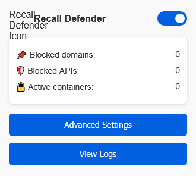

# Recall Defender for Firefox 🛡️

A privacy-focused Firefox extension that blocks Microsoft Recall telemetry and protects against unwanted data collection.

 
## ✨ Features

- 🔥 **Blocks Recall domains**: `telemetry.microsoft.com`, `recall.windows.com`, etc.
- 🚫 **Disables tracking APIs**: Screen capture, Canvas fingerprinting, WebRTC
- 🌍 **Multi-language support**: English, Spanish, Portuguese, German, Italian, French
- 🔒 **Automatic isolation**: Firefox Containers for Microsoft sites
- 📊 **Real-time monitoring**: Activity logging and statistics

## 🚀 Installation

### From Firefox Add-ons

### Manual Installation

git clone https://github.com/Odisey25/recall-defender-firefox.git
cd recall-defender-firefox

    Open Firefox and navigate to about:debugging#/runtime/this-firefox

    Click "Load Temporary Add-on"

    Select the manifest.json file

🛠️ Development
bash

# Install web-ext tool
npm install --global web-ext

# Run in development mode
web-ext run

# Build package
web-ext build

📂 Project Structure
text

recall-defender-firefox/
├── src/
│   ├── background/    # Core blocking logic
│   ├── content/       # API protections
│   ├── options/       # Settings page
│   └── popup/         # Extension popup
├── icons/             # Extension icons
├── _locales/          # Translations
└── manifest.json      # Extension config

🤝 Contributing

We welcome contributions! Please follow these steps:

    Fork the repository

    Create a feature branch (git checkout -b feature/your-feature)

    Commit your changes (git commit -am 'Add some feature')

    Push to the branch (git push origin feature/your-feature)

    Open a Pull Request

💖 Support This Project

If you find this extension useful, consider supporting its development:

https://img.shields.io/badge/Donate-PayPal-blue.svg

Your support helps maintain and improve this privacy tool!
📜 License

MIT © Odisey25

  
 

[Support] [PayPal] [Buy Me a Coffee]